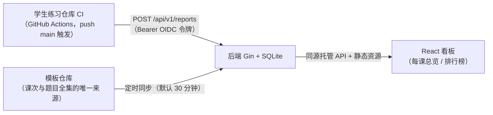

# redrock_bework_center

红岩网校后端课程的**作业统计看板**：接收学生练习仓库 CI 上报的自测报告，聚合成每课总览与完成度排行榜。

学生侧练习仓库：[jack-wang-176/redrock_backend_practice_2026](https://github.com/jack-wang-176/redrock_backend_practice_2026)

## 整体架构



| 目录 | 职责 |
|---|---|
| `backend/` | Go（Gin + SQLite）：校验并接收上报、看板查询、从模板仓库同步课次与题目全集 |
| `frontend/` | React SPA：消费 `/api/v1/overview` 与 `/api/v1/leaderboard`，构建产物由后端同源托管 |
| `docs/` | 接口契约 [`center-site-api.md`](docs/center-site-api.md)、数据模型 [`site-data-model.md`](docs/site-data-model.md) |
| `compose*.yaml` | 单容器部署：SQLite 落命名卷，`/healthz` 健康检查 |

## 与练习仓库的联动

一次完整的提交流程：

```text
学生「Use this template」建出自己的仓库
  → 填 config.json（姓名、课次、中心地址）
  → 做题，push 到 main
  → CI 校验配置 → 只跑所选课次的 go test → 取 GitHub OIDC 令牌，把逐题结论上报本站
  → 看板更新该学生该课次的完成题数
```

**上报鉴权**：站点启用 `--oidc-aud` 后，`POST /api/v1/reports` 只接受 GitHub Actions 签发的 OIDC 令牌，且令牌声明的仓库 / commit 必须与载荷一致——外部直接 POST 无法再刷榜。鉴权细节见 [docs/center-site-api.md](docs/center-site-api.md) §4.1；模板仓库侧需同步改造（workflow 取 OIDC 令牌上报），规格由练习仓库维护。

两边的职责边界：

| 仓库 | 负责什么 | 不负责什么 |
|---|---|---|
| 练习仓库（学生侧） | 题目、starter、测试，跑测试并产出报告 | 不存储成绩 |
| 本仓库（统计中心） | 校验、接收、聚合、展示；题目全集以模板仓库为准 | 只统计作业结果 |
